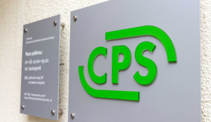

<!doctype html>
<html lang="ru">
<head>
    <meta charset="UTF-8">
    <meta name="viewport"
          content="width=device-width, user-scalable=no, initial-scale=1.0, maximum-scale=1.0, minimum-scale=1.0">
    <meta http-equiv="X-UA-Compatible" content="ie=edge">
    <link rel="stylesheet" href="style.css">
<link rel="stylesheet" href="fonts/stylesheet.css">
    <meta name="viewport" content="width=device-width, initial-scale=1, maximum-scale=1 ">
    <title>Document</title>
</head>
<body>

<header class="header">
    
  

    
  

    <nav class="header-menu">
               <ul class="header-menu__icon">
           <li class="header-menu__icon-1">
               
           </li>
            <li class="header-menu__icon-2">
                
            </li>
            <li class="header-menu__icon-3">
                
            </li>
            <li  class="header-menu__icon-4">
        

   
Оставить заявку

            </li>
                   <li class="header-menu__icon-5">
     
           
 Статус ремонта

            </li>
               </ul>
           </nav>
</header>

<main class="content">
    <section class="content-menu">
    <h1> Услуги и сервисы</h1>
    <ul class="content-menu__item">
        <li class="content-menu__item-list_1">Ремонтируемые устройства</li>
        <li class="content-menu__item-list_2">Дополнительные услуги</li>
        <li class="content-menu__item-list_3">Цены на услуги</li>
        <li class="content-menu__item-list_4">Адреса сервисных центров</li>
        <li class="content-menu__item-list_5">Специальные цены</li>
        <li class="content-menu__item-list_6">Отзывы</li>
    </ul>
    </section>

 <section class="content-about">
    

       
Мы являемся авторизованным сервисным центром по ремонту техники Dell. Только у нас вы можете отремонтировать свой ноутбук Dell с официальной гарантией производителя.

 
        
 Мы успешно работаем с 1992 года и заслужили репутацию надежного партнера
        ,что подтверждает большое количество постоянных клиентов. Мы гордимся тем, что к нам обращаются по рекомендациям и, в свою очередь, советуют нас родным и близким.

        
 
        Читать далее

     

     
 

    </section>

  </main>
</body>
</html>
